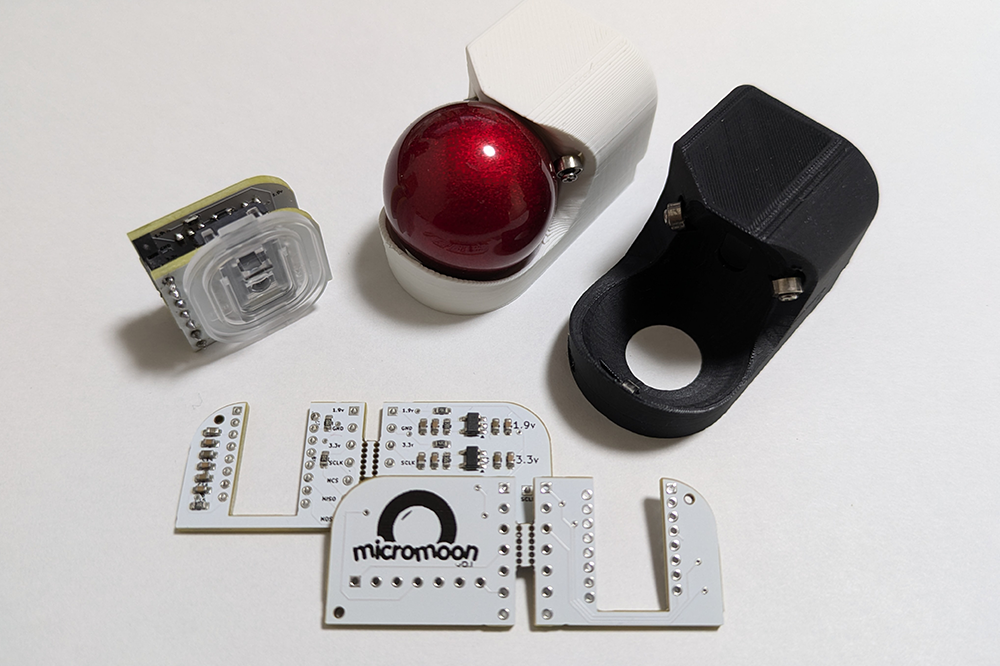
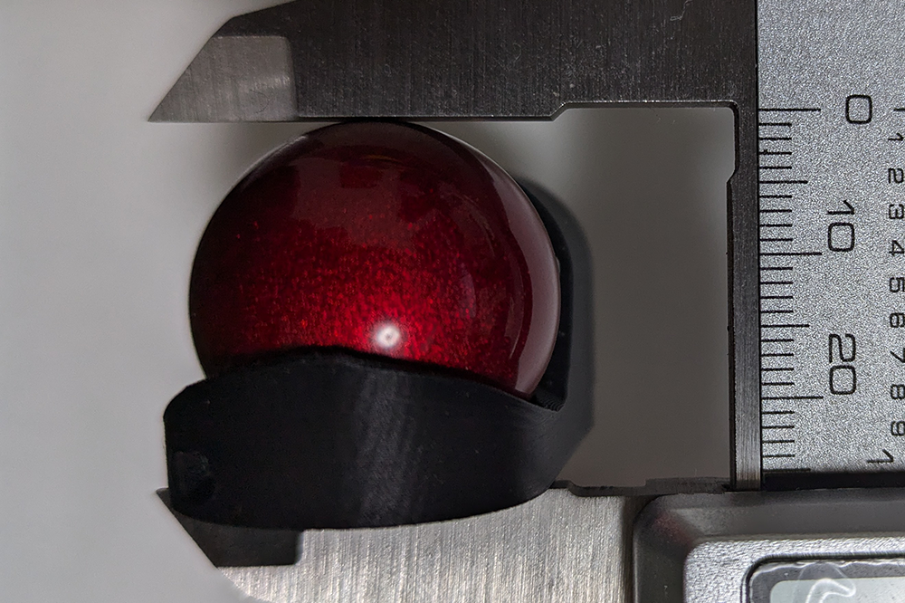
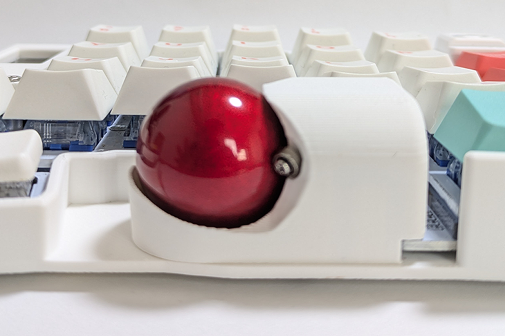

# micromoon
micromoonは[keyball](https://github.com/Yowkees/keyball/)用のlowprofile版トラボセンサー基板です

特徴:

+ keyballとの互換性
  + 61,44での動作確認済み
+ 全長25mm、25mmトラックボール専用
    
+ (セット共通)micromoon用トラックボールケース
  + ベアリング駆動

## Whare to Buy

[BOOTH](https://subquest.booth.pm/items/6456795)にて購入可能

## Attention

+ 製品について
  + keyballの類似製品との互換性は確認していません(ex:roBa,moNa)
  + 右トラボ向けに設計しているため、左トラボ向けには見た目があります。
+ ケースについて
  + 素材はPLAのマットタイプを使用しています。
  + 家庭用3Dプリンターで製造しているため、積層の痕があります。

## Build Guide

ビルドガイドは[こちら](https://github.com/tsuruno/micromoon/blob/master/buildguide/buildguide.md)
