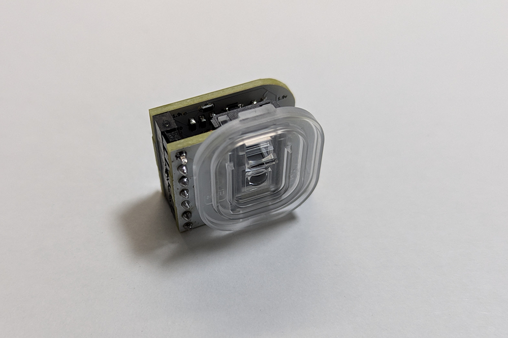

# Build Guide for micromoon

- [Build Guide for micromoon](#build-guide-for-micromoon)
  - [部品確認](#部品確認)
    - [キット内容](#キット内容)
    - [必要な工具](#必要な工具)
  - [作業](#作業)
      - [基板分解](#基板分解)
      - [基板組み立て](#基板組み立て)
      - [処理](#処理)
      - [取付](#取付)
    - [動作確認](#動作確認)
  - [トラブルシューティング](#トラブルシューティング)
    - [githubのissueで報告お願いします。](#githubのissueで報告お願いします)

## 部品確認

### キット内容

| 名前 | 数 | 備考 |
|:-|---:|:-|
|メイン基板|1組||
|PMW3360DM-T2QU| 1個|トラックボールセンサー|
|7pin ピンヘッダ(オスメス)|1組||
|トラックボールケース| 1組 | 3Dプリント品|
|ネジ| 3個 ||
|ベアリング|3個||
|絶縁テープ|1枚|メイン基板に貼っている黄色いシールです|

25mmトラックボールは以下からお求め下さい
+ [エレコム トラックボール用交換ボール 直径25mm M-RT1DRBK/M-RT1BRXBKレッド M-B25RD](https://www.amazon.co.jp/%E3%82%A8%E3%83%AC%E3%82%B3%E3%83%A0-%E3%83%88%E3%83%A9%E3%83%83%E3%82%AF%E3%83%9C%E3%83%BC%E3%83%AB%E7%94%A8%E4%BA%A4%E6%8F%9B%E3%83%9C%E3%83%BC%E3%83%AB-M-RT1DRBK-M-RT1BRXBK%E3%83%AC%E3%83%83%E3%83%89-M-B25RD/dp/B0D4DYH8XY/ref=sr_1_5_pp?__mk_ja_JP=%E3%82%AB%E3%82%BF%E3%82%AB%E3%83%8A&crid=288TQ0WQ2PHAG&dib=eyJ2IjoiMSJ9.7e1m5Nvhz2OQyDgK9OTI5QSD2GTxSldG4gbLIXYjfCfC-v5XC7RZ9kXs65EXkVboMaPECA7TTQLBI0kVbC7STmc_jhn1kWkoFWdb7JhAsqX5qrK0wluneXsBx6oBwbfP54VZwZzM-3YfefecH50XqmHfKmWqQQ04qdzBZCBJdP0t71J0vRUSkEOu5nIjL_6MBTQwKdGsOAz19CJQqFOa4rs1AhIeXTuH8pLk9DEclAyKLFr1LjgclVMLVZmzD4QEdjOtZxFWPsa8EFyUBm-9hA6ItrOlNyrCyZbI1w174GYNbKbTv1EVcvHBVHjA-3PMR4ykTJGtembiLG9tuucFgDKzGvYfM9HiILAW2QykCculCvMT41fn3JLf2cK92-_7hxzrva2r7jUYjpbxN938KiQpLBxPqzlnyAX66dPkAR2JhXQs6L8nl71MeQvLI5IG.2mYeFq9_INv17XTvtjXYfzjNRdK5a4L8RTNsG3vPCGk&dib_tag=se&keywords=25mm+%E3%83%88%E3%83%A9%E3%83%83%E3%82%AF%E3%83%9C%E3%83%BC%E3%83%AB&qid=1737887801&sprefix=25mm+%E3%83%88%E3%83%A9%E3%83%83%E3%82%AF%E3%83%9C%E3%83%BC%E3%83%AB%2Caps%2C226&sr=8-5)
+ [Perixx(ペリックス) PERIPRO-305GRD 25㎜ 交換用トラックボール 光沢仕上げ レッド](https://www.amazon.co.jp/Perixx-%E3%83%9A%E3%83%AA%E3%83%83%E3%82%AF%E3%82%B9-PERIPRO-305GRD-%E4%BA%A4%E6%8F%9B%E7%94%A8%E3%83%88%E3%83%A9%E3%83%83%E3%82%AF%E3%83%9C%E3%83%BC%E3%83%AB-%E5%85%89%E6%B2%A2%E4%BB%95%E4%B8%8A%E3%81%92/dp/B0BDZJFYCH/ref=sr_1_6?__mk_ja_JP=%E3%82%AB%E3%82%BF%E3%82%AB%E3%83%8A&crid=288TQ0WQ2PHAG&dib=eyJ2IjoiMSJ9.7e1m5Nvhz2OQyDgK9OTI5QSD2GTxSldG4gbLIXYjfCfC-v5XC7RZ9kXs65EXkVboMaPECA7TTQLBI0kVbC7STmc_jhn1kWkoFWdb7JhAsqX5qrK0wluneXsBx6oBwbfP54VZwZzM-3YfefecH50XqmHfKmWqQQ04qdzBZCBJdP0t71J0vRUSkEOu5nIjL_6MBTQwKdGsOAz19CJQqFOa4rs1AhIeXTuH8pLk9DEclAyKLFr1LjgclVMLVZmzD4QEdjOtZxFWPsa8EFyUBm-9hA6ItrOlNyrCyZbI1w174GYNbKbTv1EVcvHBVHjA-3PMR4ykTJGtembiLG9tuucFgDKzGvYfM9HiILAW2QykCculCvMT41fn3JLf2cK92-_7hxzrva2r7jUYjpbxN938KiQpLBxPqzlnyAX66dPkAR2JhXQs6L8nl71MeQvLI5IG.2mYeFq9_INv17XTvtjXYfzjNRdK5a4L8RTNsG3vPCGk&dib_tag=se&keywords=25mm+%E3%83%88%E3%83%A9%E3%83%83%E3%82%AF%E3%83%9C%E3%83%BC%E3%83%AB&qid=1737887801&sprefix=25mm+%E3%83%88%E3%83%A9%E3%83%83%E3%82%AF%E3%83%9C%E3%83%BC%E3%83%AB%2Caps%2C226&sr=8-6)

ケースは[こちら](https://github.com/tsuruno/micromoon/case)にて公開しています。

### 必要な工具

| 名前 | 備考 |
|:-|:-|
|はんだごて||
|はんだ||
|ドライバ||
|やすり||

## 作業

#### 基板分解

基板の分解を行います
トラボセンサーの
外側は手で割れます

中央はニッパーで分離します。

#### 基板組み立て

ピンヘッダとセンサーを取り付けます。
画像左をセンサー側基板、画像右をコンスルー側基板と呼びます。

センサー側の基板は以下の通りです。
※穴とのサイズが丁度のサイズなので、垂直にはめて下さい。

(左): 組み立て後
(右): 組み立て前

コンスルー側の基板は以下の通りです。

(左): 組み立て後
(右): 組み立て前

最後にピンヘッダを合わせます

#### 処理

コンスルー側の半田を盛り過ぎるとkeyballの基板を傷つける場合があります。
keyballのGNDが近くに走っているため、回路がショートして動かない事象がある可能性があるので、強めにやすりがけをします。

イメージ図

オプションにはなりますが、絶縁テープをkeyball基板に貼ってショートしないように保護することをオススメします

#### 取付

keyballのコンスルーに取り付けます。

ケースを上から取り付けて、裏面をネジで締めて固定します。

### 動作確認

専用のマイコンの書き込みは不要です。
電源を入れてマウスカーソルが動けば動作確認完了です。

## トラブルシューティング

### githubのissueで報告お願いします。

報告あったものはここに随時対処方法を記載していきます。